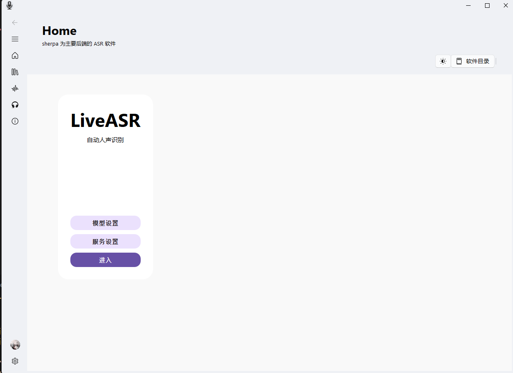

# LiveASR

----

简介：本项目是基于 sherpa-onnx 搭建的一个实时语音识别系统。

<p align="center">
  
</p>

### 系统安装步骤

```shell
git clone https://github.com/LJoson/LiveASR.git
# 首先安装必要的python库
cd ./LiveASR
pip3 install -r requirements.txt
```

### 系统运行步骤

在安装完必要的库之后，就可以运行了，主要的运行文件是 LiveASRGUI.py，运行该文件即可启动系统。（由于gpu部分功能未测试，所以暂时没有使用gpu）

```shell
python3 LiveASRGUI.py
```


### 实现原理

1. 通信

   项目中的通信主要使用的是 Websocket 模块实现

2. 异步编程

   项目中的异步编程主要使用的是 asyncio 模块实现，其中主要的异步任务包括：

   - 语音识别任务：使用 sherpa-onnx 模块进行语音识别，并将识别结果动态刷新

### 致谢与引用

本项目在开发过程中参考和使用了以下开源项目和技术，在此表示诚挚的感谢：

#### 核心语音识别引擎
- [sherpa-onnx](https://github.com/k2-fsa/sherpa-onnx) - 基于 ONNX 的语音识别工具包，提供了高效的语音识别功能
- [Whisper](https://github.com/openai/whisper) - OpenAI 开发的开源语音识别模型，为语音识别技术提供了重要参考
- [speech-to-text](https://github.com/reriiasu/speech-to-text) - 基于 faster-whisper 的实时语音转文字项目，提供了优秀的实时转录功能

#### 中文语音识别相关
- [FunASR](https://github.com/modelscope/FunASR) - 阿里巴巴达摩院开源的中文语音识别工具包
- [PPASR](https://github.com/yeyupiaoling/PPASR) - 基于 PaddlePaddle 的中文语音识别项目
- [RapidASR](https://github.com/RapidAI/RapidASR) - 快速语音识别框架

#### 语音识别 GUI 工具
- [faster-whisper-GUI](https://github.com/CheshireCC/faster-whisper-GUI) - Faster Whisper 的图形界面实现
- [Whisper-WebUI](https://github.com/jhj0517/Whisper-WebUI) - Whisper 的 Web 界面实现
- [WhisperGUI](https://github.com/ADT109119/WhisperGUI) - Whisper 的桌面应用界面
- [asr-gui](https://github.com/farhadcuber/asr-gui) - 语音识别图形界面工具

#### 其他相关项目
- [CapsWriter-Offline](https://github.com/HaujetZhao/CapsWriter-Offline) - 离线语音输入工具
- [buzz](https://github.com/chidiwilliams/buzz) - 语音转文字工具
- [Const-me/Whisper](https://github.com/Const-me/Whisper) - Whisper 的 C++ 实现

#### 技术参考
- [51CTO 文章](https://www.51cto.com/article/778871.html) - 关于语音识别技术的技术文章
- [IDC 帮助文档](https://www.idc.net/help/414963/) - 语音识别相关技术文档

### 许可证

本项目遵循 GNU 通用公共许可证（GPL）。详情请参阅 [LICENSE](LICENSE) 文件。

### 欢迎贡献

我们非常欢迎任何形式的贡献，包括但不限于：

- 提交问题和建议
- 改进文档
- 添加新功能
- 修复 bug
- 优化性能

如果您想为项目做出贡献，请遵循以下步骤：

1. Fork 本仓库
2. 创建您的特性分支 (`git checkout -b feature/amazing-feature`)
3. 提交您的更改 (`git commit -m 'Add some amazing feature'`)
4. 推送到分支 (`git push origin feature/amazing-feature`)
5. 开启一个 Pull Request

### 反馈与建议

如果您在使用过程中遇到任何问题，或有任何建议和意见，欢迎通过以下方式联系我们：

- 在 GitHub 上提交 [Issue](https://github.com/LJoson/LiveASR/issues)
- 发送邮件至：1250377062@qq.com

您的反馈对我们非常重要，将帮助我们不断改进和完善这个项目。
